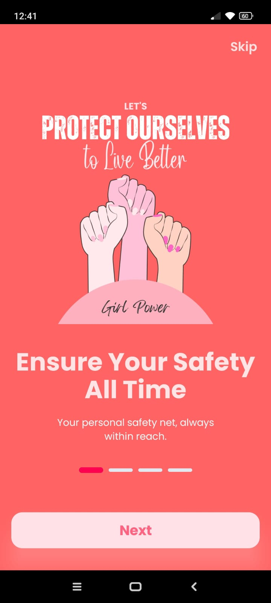
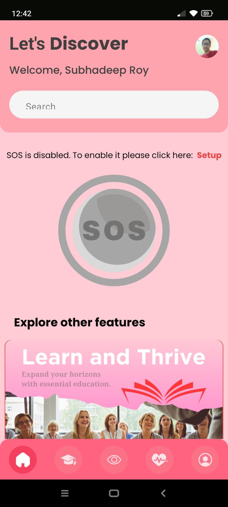
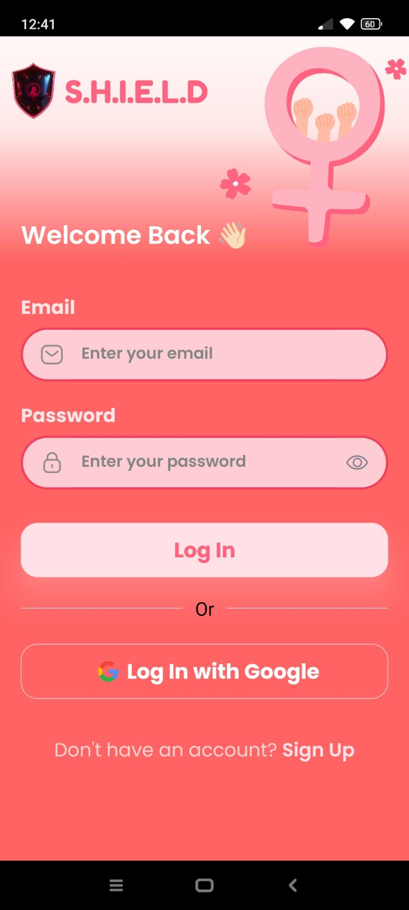
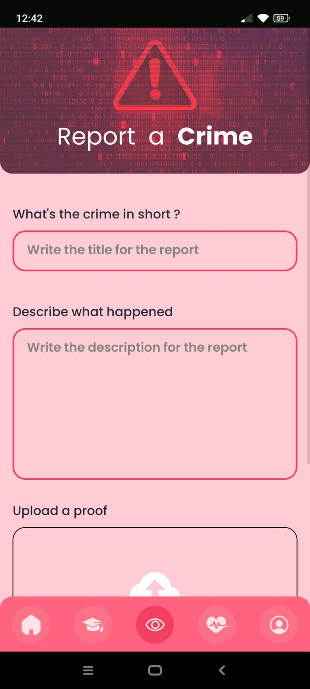
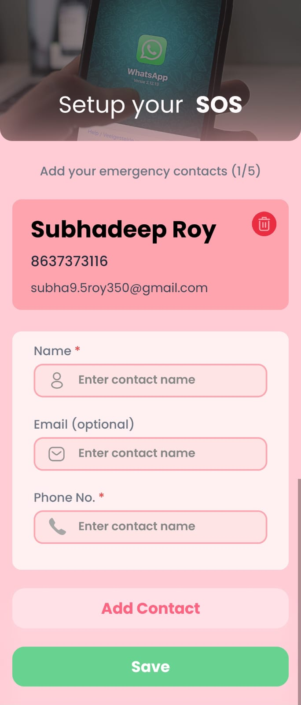

# Shield: The All-in-One App for Women's Empowerment

**Shield** is an innovative mobile application designed to address critical issues related to women's safety, education, healthcare, and overall well-being. This app empowers women by providing a comprehensive set of tools and features that ensure their safety, enable them to report crimes, access educational resources, and maintain their health.

## Features

### 1. Women Safety (SoS)
- **Emergency Contacts:** Women can add up to 5 contacts, including their email addresses (optional).
- **SoS Alert:** In case of an emergency, an SoS button sends immediate SMS and email alerts to the listed contacts and calls the emergency number.
  
### 2. Crime Reporting
- **Report Crime:** Women can report crimes or incidents they witness or experience.
- **Evidence Upload:** Ability to upload images, videos, or descriptions of the crime for accurate reporting.

### 3. Police Dashboard
- **Location Tracking:** Police can log in to view the locations or track the IP address when the SoS button is clicked.
- **Crime Reports Management:** Real-time notifications and access to crime reports submitted by women. Officers can review and take action on these reports promptly.

## App Structure

The following table provides a visual representation of the app's structure and its key features:

| **Feature**          | **Description**                                                                                          | **Image**                       |
|----------------------|----------------------------------------------------------------------------------------------------------|---------------------------------|
| **Onboarding Screen**      | Opening the app for the first time will show like this.     |  |
| **Home Screen**      | Central hub of the app showing quick access to SoS, crime reporting, education, healthcare, and more.     |  |
| **Authentication Feature**      | Women are requested to amke an account. Data will always be safe and secure.                                |   |
| **Crime Reporting**  | Interface to report crimes with options to upload evidence.                                               |  |
| **SOS Setup**  | You have to add contacts to           enable the SOS feature                     |  |

## Getting Started

### Prerequisites
- **iOS/Android Device:** The app is compatible with both platforms.
- **Internet Connection:** Required for reporting crimes, SoS alerts, and accessing educational and healthcare resources.

### Installation

1. **Clone the Repository:**
   ```bash
   git clone https://github.com/algovengers/shield.git
   ```

2. **Install Dependencies:**
   ```bash
   cd shield-app
   npm install in the 'shield-app' and 'website' and 'backend' folder
   ```
3. **Run the App:**
   ```bash
   npm start in any of the folder
   ```

## Contact
For support or inquiries, please contact us at:
- **Email:** shield-org@outlook.com